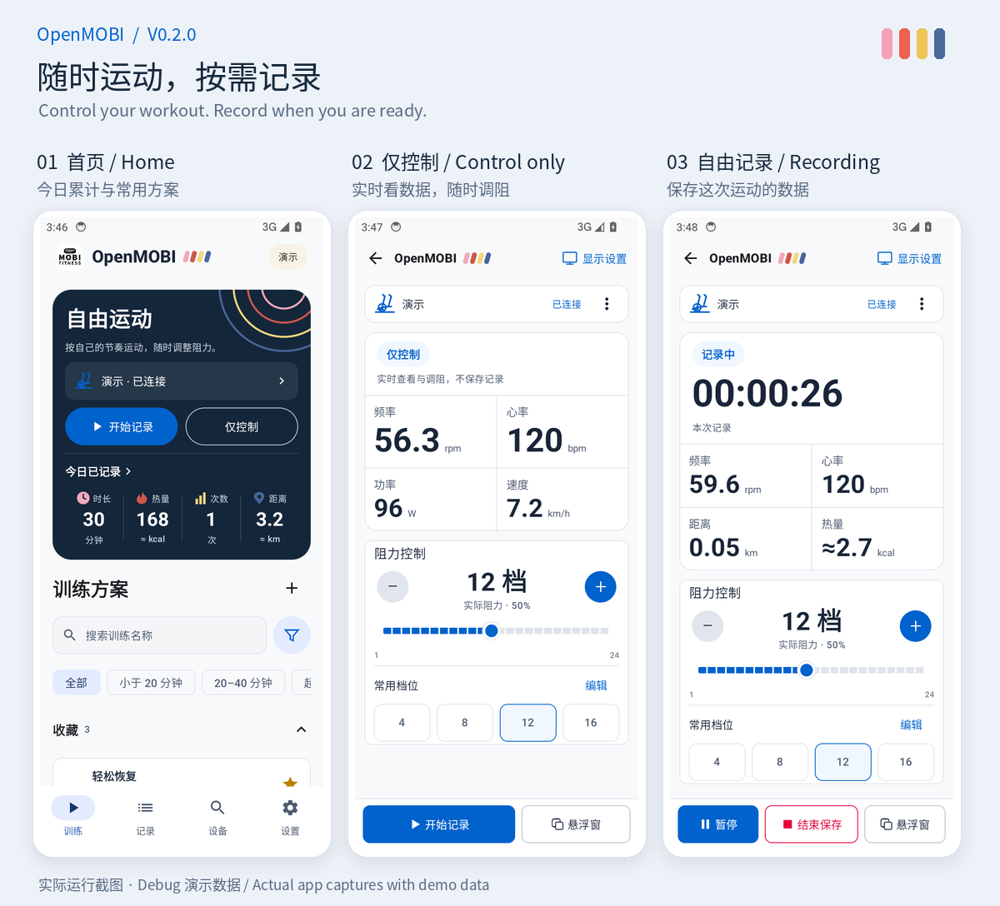
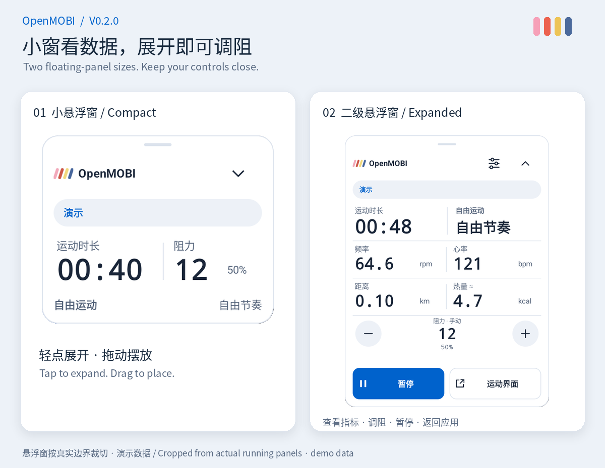

# OpenMOBI

**让莫比健身器材继续用起来。**

简体中文 · [English](README.en.md)

OpenMOBI 是一款独立开发的 Android 应用，让莫比健身器材在官方服务停止后仍能连接蓝牙、调节阻力、完成训练。无需账号，运动记录保存在本机。

## 下载

**[下载 v0.2.0 普通版](https://github.com/q1ngyang/open-mobifitness/releases/download/v0.2.0/OpenMOBI-0.2.0.apk)** · [所有版本](https://github.com/q1ngyang/open-mobifitness/releases) · [更新说明](docs/releases/v0.2.0.md)

支持 Android 10 及以上的 64 位手机和平板，可与官方 App 共存。

**日常使用请选择文件名不带 `debug` 的 APK。** Debug 版用于测试，包含演示设备，和普通版的数据互相独立。

目前只有 **V1 协议的莫比 MB-EP 椭圆机**有用户实机反馈，其他型号尚无实机反馈；当前不控制跑步机的启动、速度或坡度。[查看设备支持情况](docs/COMPATIBILITY.md)

## 可以做什么

- **想记再记**：仅控制模式可以看数据、调阻；需要时开始记录，也可跟随 21 套内置方案或自定义训练。
- **边看边练**：全屏运动页和两级悬浮窗，按需选择指标，记住悬浮位置与常用档位。
- **按自己的节奏**：手动设置频率或心率范围，按需开启提示，不会自动调阻。
- **看见积累**：今日统计、历史记录与单次详情，支持 CSV 报告、完整备份和设置迁移。
- **适应你的屏幕**：手机、平板与折叠窗口布局，浅色／深色模式，六种界面语言。

## 界面

以上为 v0.2.0 实际运行截图，使用 Debug 演示数据；展示排版不改变应用界面。[查看平板与更多界面](docs/SCREENSHOTS.md)

## 连接异常？请告诉我们

**搜不到器材、连接后没有数据、调阻无效，都欢迎反馈。** 请到「设置 → 设备诊断」确认已开启「记录蓝牙协议报文」，再连接并复现问题，随后导出日志。

[提交问题](https://github.com/q1ngyang/open-mobifitness/issues/new/choose)时附上器材型号、手机／平板型号、Android 版本和日志。不确定怎么做？[查看分步指引](docs/HELP.md)。

## 更多说明

[开始使用](docs/USER_GUIDE.md) · [训练与数据估算](docs/TRAINING.md) · [隐私与权限](docs/PRIVACY.md) · [文档目录](docs/README.md) · [参与开发](docs/DEVELOPMENT.md)

OpenMOBI 与原厂没有隶属关系。新增代码采用 [Apache-2.0](LICENSE)；原品牌字标权利归其所有者，见[素材说明](docs/BRANDING.md)。作者：[q1ngyang](https://x.com/q1ngyang)。
