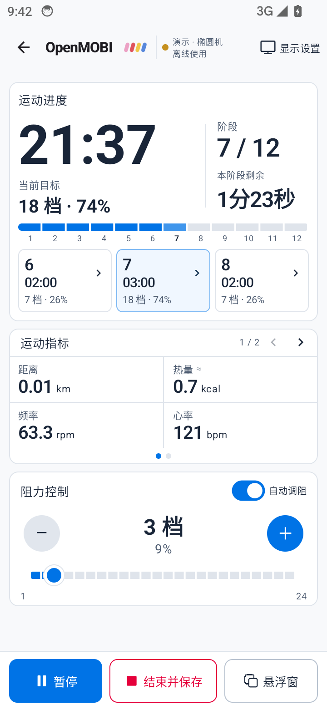
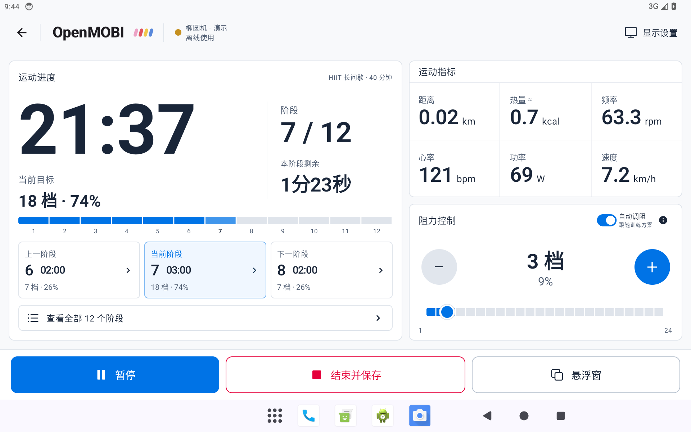

# OpenMOBI

**运动，由你掌控。Your movement. Your device.**

OpenMOBI 是为莫比健身器材重新实现的离线 Android 控制与训练应用。无需登录、在线激活或厂商服务器。

这是独立原生工程，参考原国际版的设备协议与简洁体验，结合中国版中可恢复的训练能力；不包含官方 APK、全量反编译源码、商业课程或旧第三方 SDK。图标使用经添加 Open 标识的 MOBI FITNESS 字标，素材来源与浅深色版本见 [品牌素材](docs/BRANDING.md)。

## 当前版本

`0.1.0-alpha.4`，包名 **`org.openmobifitness.app`**。调试包为 `org.openmobifitness.app.debug`。两者都可以与官方 App 共存。

这是经过模拟器初步验证、仍需实机验证的测试版。**器材协议实现不等于已通过器材实测。**已用用户提供的 MB-EP 椭圆机真实报文验证接收解析，alpha.3 实机日志已收到变化的阻力反馈；alpha.4 恢复的功率模型仍待实机复核；各协议能力和限制见 [兼容性](docs/COMPATIBILITY.md)。

- 本地 BLE 发现、连接、能力读取与受支持的阻力控制；修复 V1 `AB 04` 状态报文识别。
- 独立训练状态、分段调度、手动优先、断连暂停；不会自动重连后重放控制命令。
- 自由运动、21 套原创离线模板（含 40 分钟进阶有氧、多级 HIIT）、自定义时间／距离／桨数阶段。
- Room 本地记录、逐秒采样、异常中断记录恢复。
- CSV 摘要／采样／训练方案与 ZIP 备份，导入预览、内容去重、冲突事务回滚。
- 独立全屏运动页，手机指标分页、平板分栏，浅色／深色、公制／英制。
- 17 个可选运动指标，主页面／大小悬浮窗分别选择与排序；窄屏每页四项、宽屏每页六项。统一使用「频率」，按器材显示 rpm／spm；热量估算、距离、阶段分秒倒计时、档位百分比与滑块调阻。
- 恢复 V1 椭圆机／单车的官方功率估算模型，功率来源标记随 CSV／备份保存。
- 固定底部结束按钮、相邻阶段预览、运动页常亮；平板使用训练进度与仪表双栏。
- **两级悬浮控制面板**：小窗显示自选指标，点击展开阻力／暂停／返回运动页，拖动移动；默认自动悬浮，固定尺寸、等宽数字和自动缩字号。
- 完整资源键集合：简体中文、繁体中文、英语、日语、韩语、德语。
- 手动检查本仓库 GitHub Release（alpha 版包含后续预发布，稳定版仅检查稳定更新）；核心训练不依赖网络。
- 明确标注的演示模式与可导出的本地诊断日志与按需启用的蓝牙协议报文，自动按时间及容量清理，导出小于 128 KiB。

训练、指标来源与估算说明见 [训练说明](docs/TRAINING.md)。

原服务器的完整官方训练目录不在提供的 APK 中。内置模板是 OpenMOBI 原创，不宣称还原了这些丢失的课程。





上图为 Android 14 模拟器中的真实界面，显示的是明确标注的演示数据。布局、近方形折叠窗口和悬浮设置说明见 [设计与实装](docs/UI_DESIGN.md)。

## 安装与首次验证

在 [Releases](https://github.com/q1ngyang/open-mobifitness/releases) 下载签名 APK。首次器材验证建议按 [测试指南](docs/TESTING.md) 进行。

1. 断开官方 App 对器材的连接，唤醒器材，在 OpenMOBI「设备」页搜索。
2. 允许附近设备权限；Android 10–11 还需要位置权限及系统定位服务。
3. 连接后先查看协议、阻力范围和频率／阻力反馈，再以相邻档位验证调节。
4. 在「设置 → 悬浮窗」授予显示在其他应用上层的权限。悬浮功能和自动悬浮默认开启；运动期间回桌面／切换应用会显示小窗。训练页「悬浮窗」可手动缩小，也可在设置中关闭自动显示。
5. 在「记录」或「设置」导出 CSV／备份；记录留在本机。

“暂停”和“结束并保存”不等同于器材停机。当前版本不发送跑步机电机启动、速度、坡度或固件更新命令。无反馈时不会把请求值当成实测阻力。

## 构建

- Android 10+ (`minSdk=29`)，compile / target API 37。
- JDK 21、Gradle 9.3.1、Android Gradle Plugin 9.1.1、Kotlin 2.2.10。
- Android SDK `platforms;android-37.0`、`build-tools;36.0.0`。
- 安装包包含 arm64 与 x86_64；x86_64 用于模拟器，不再包含 32 位原生库。

```sh
export JAVA_HOME=/path/to/jdk-21
export ANDROID_HOME=/path/to/android-sdk
python3 tools/check_resources.py
./tools/build.sh :core:test :app:testDebugUnitTest :app:lintDebug :app:assembleDebug
```

设置 `DEV_TEMP_BASE` 时，构建输出、Gradle 项目缓存与 Kotlin 缓存全部放到该开发盘，避免写入同步源码树；不需要创建构建目录的同步链接。未设置时使用 Gradle 默认目录。不要把原始 APK、密钥或本地工具目录提交到 Git。

发行签名使用环境变量 `OPENMOBI_KEYSTORE`、`OPENMOBI_STORE_PASSWORD`、`OPENMOBI_KEY_PASSWORD`，alias 为 `openmobi`：

```sh
./tools/build.sh :app:assembleRelease
```

未提供签名环境变量时输出未签名的 release APK。正式更新需要继续使用原发行密钥；CI 不存储或生成替代密钥。

## 工程结构

- `core`：不依赖 Android 的协议编解码、训练模型、训练执行与 CSV 契约。
- `app/ble`：GATT 操作串行化、超时、特征能力和控制点响应。
- `app/data`：Room、事务导入、文件备份及 GitHub 更新检查。
- `app/service`：器材连接前台服务、悬浮控制面板。
- `app/ui`：Compose 自适应界面和六语言资源。
- `docs`：协议范围、数据契约、验收和开发说明。

## English

OpenMOBI is an independent, offline Android companion for Mobi fitness equipment. It replaces account/server dependencies with local BLE control, workout scheduling, local history, CSV exchange and an interactive floating control panel.

This alpha is **awaiting physical equipment validation**. Implemented protocol paths are not a guarantee of compatibility with every model. Device capabilities gate commands; treadmill motor commands and firmware updates are deliberately excluded from this build. Original online course catalogs cannot be recovered from the APKs alone.

The application supports English, Simplified Chinese, Traditional Chinese, Japanese, Korean and German. New source code is licensed under Apache-2.0. It contains no official APKs or commercial course content.

See [compatibility](docs/COMPATIBILITY.md), [data format](docs/DATA_FORMAT.md), [testing](docs/TESTING.md) and [privacy](docs/PRIVACY.md).
