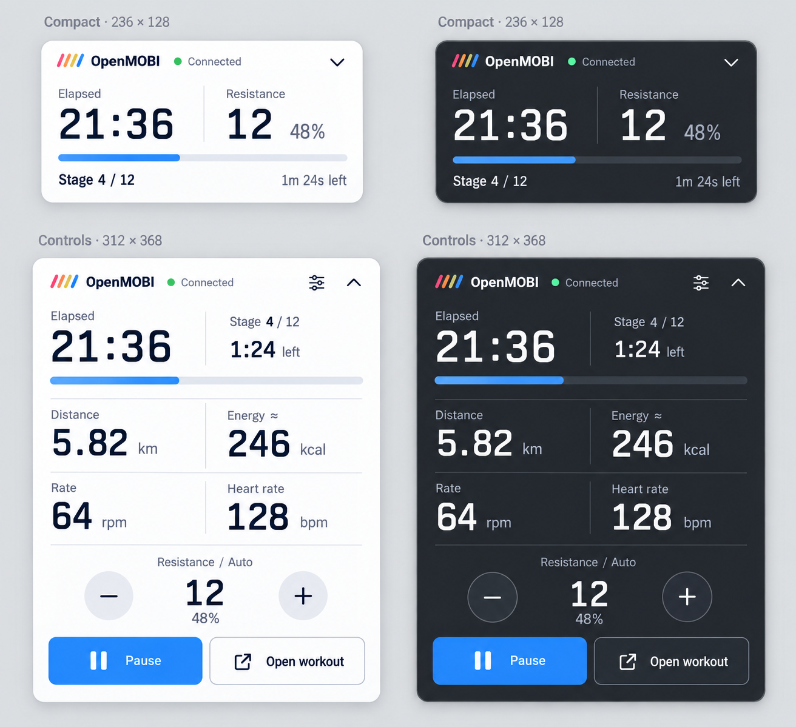
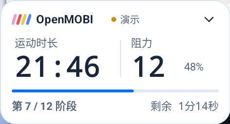
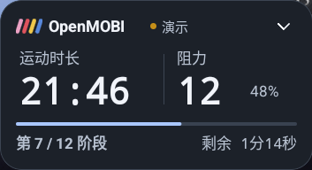
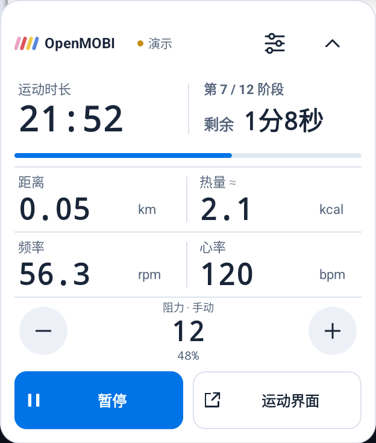
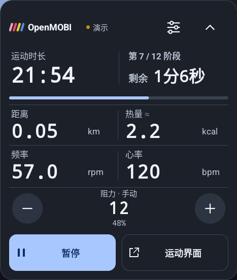
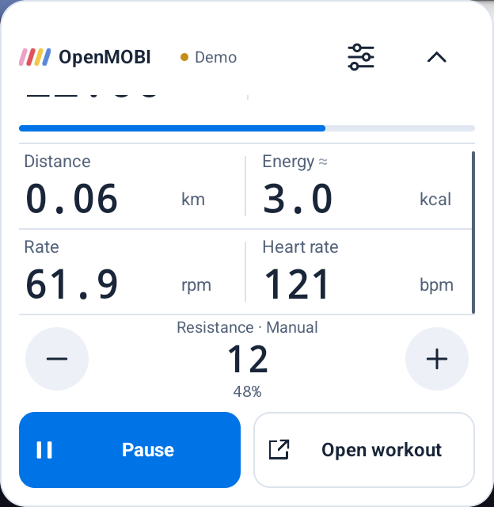

# alpha.5 悬浮面板

悬浮窗用于边看视频边运动：小窗回答“运动了多久、当前是什么档位、这一阶段还剩多久”；大窗提供短时间内需要的读数与控制。运动主界面沿用 alpha.4 的设计。

## 先生成，再实现

通过内置 `image_gen` 工具生成浅／深色、两种尺寸的设计稿，再用 Android 原生 View 与矢量绘制实现。没有把设计图当作界面，也没有引入图片按钮或新的图标字体。

- [生成设计稿](design/overlay-alpha5-concept.png)
- [完整生成提示词](design/overlay-alpha5-prompt.txt)

## 内容和操作

| | 小窗 | 大窗 |
|---|---|---|
| 标准尺寸 | 236 × 128 dp | 312 × 368 dp |
| 主要读数 | 两项自选，默认运动时长、阻力 | 固定运动时长／阶段，另选四项指标 |
| 阶段 | 当前阶段、剩余分秒、阶段进度条 | 当前阶段、剩余分秒、阶段进度条 |
| 操作 | 点击展开；拖动移动 | 阻力加减、暂停／继续、返回运动页、收起、自选指标 |
| 移动 | 整个面板可拖动 | 拖动标题区域 |

已有自选指标继续保留。新默认只适用于未保存过小窗指标的用户；可以在「显示设置 → 小悬浮窗」选择运动时长、阻力来使用这个组合。大窗默认距离、热量、频率和心率，功率等仍可自行替换。

进度条表示**当前阶段**的完成比例，切换阶段后重新开始。非时间阶段显示完成百分比；自由运动和计划完成后显示自由节奏。暂停／演示／未连接都有文字提示，不能只凭状态点颜色判断连接状态。中央档位使用实际反馈，等待确认期间只改变状态文字。

## 小尺寸细节

- 数字使用真正等宽字体；不足一小时用 `mm:ss`，超过一小时保留小时。每块读数、单位和整体尺寸固定，长数字仅缩字号。
- 估算符号放在标题后并弱化；单位、阻力百分比和“剩余”提示弱化，数值承担主要视觉层级。
- 字号、字重、细分隔线和留白区分信息，取消原来混杂的文字按钮与 Unicode 图标，使用统一笔画的原生矢量图标。
- 加减、暂停、返回、收起和配置的触摸区域至少 48 dp 高。大窗遇到低矮屏幕时，中间信息区可滚动，并出现细滚动条提示；标题和底部调阻／操作区保持可见。
- 展开／收起保留靠近屏幕边缘的位置，避免面板从视频旁边跳到另一处；旋转后重新限制在可用区域内。
- 原生悬浮窗的动态读数主动刷新无障碍子树，不把每秒变化设成自动朗读内容。

## 实际截图与验证

实际截图来自 Android 模拟器的系统悬浮窗，标注为演示。窗口局部截图从同一次系统截图的可见边界直接截取，没有重新绘制或修改界面像素。测试范围与结果见 [验证记录](TESTING.md)。

| 浅色 | 深色 |
|---|---|
|  |  |
|  |  |

浅色来自 360×780 dp 手机，深色来自 1280×800 dp 平板。显示密度不同，原始截图的像素宽度不同，窗口实际使用相同的 dp 尺寸。剩余时间沿用产品的本地化分秒格式，按钮使用符合 Android 浅深色对比度的纯色，未照搬生成稿中的光影效果。

手机横屏滚动到下方指标后，调阻和底部操作仍固定在原位：

