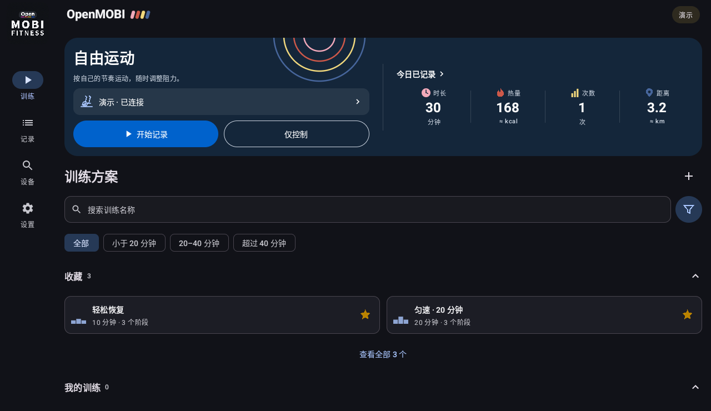
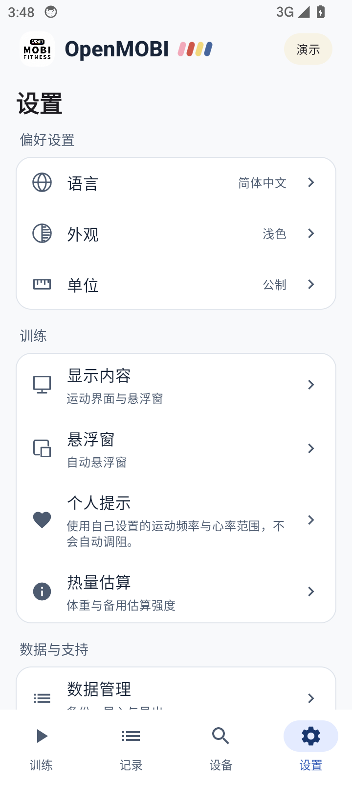
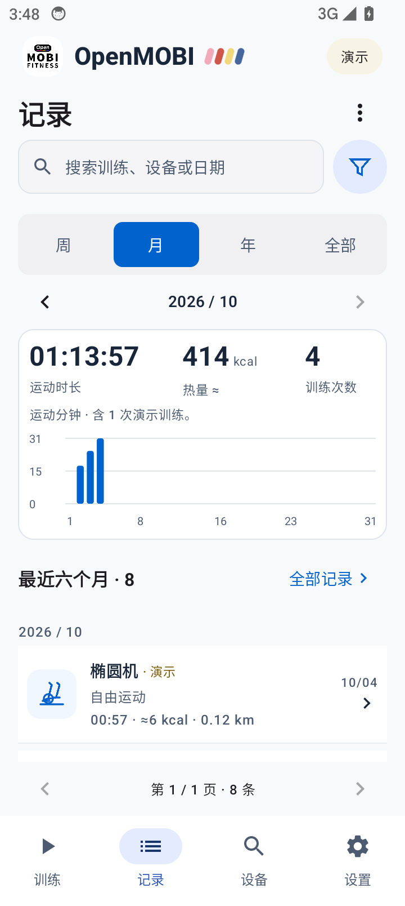

# 界面展示 / Screenshots

[首页 / Home](../README.md) · [English home](../README.en.md)

以下是 **v0.2.0 实际运行截图**，来自 Android 14 模拟器，使用 Debug 演示数据；不代表真实器材测试。手机为 360 × 780 dp、浅色，平板为 1280 × 740 dp、深色，均使用默认字体大小。

These are **actual v0.2.0 app captures** from an Android 14 emulator with Debug demo data, not evidence of hardware compatibility. The phone uses a 360 × 780 dp light layout; the tablet uses a 1280 × 740 dp dark layout, both at the default font size.

## 手机：从仅控制到记录 / Phone: control and record

查看原图 / Original captures：[首页 / Home](screenshots/home-phone.png) · [仅控制 / Control only](screenshots/control-phone.png) · [自由记录 / Recording](screenshots/workout-phone.png)

## 两级悬浮窗 / Two floating-panel sizes

小窗看数据，轻点后展开二级悬浮窗，可以调阻、暂停或回到应用。两种大小的指标均可自行选择。

View readings in the compact panel, then tap to expand for resistance controls, pause and return to the app. Choose the metrics for each panel size separately.

查看面板原图 / Panel captures：[小窗 / Compact](screenshots/overlay-compact.png) · [二级悬浮窗 / Expanded](screenshots/overlay-expanded.png)

展示图仅等比缩放、添加外侧标题与间距；悬浮窗裁去边界外的桌面背景，平板裁去系统状态栏与任务栏，未修改应用中的文字、数据或控件。Presentation images only scale the captures and add external captions and spacing. Desktop outside the floating panels and system bars around the tablet app are cropped away; app text, readings and controls are unaltered.

## 平板深色模式 / Tablet dark mode

## 设备、设置与记录 / Devices, settings and history

| 常用设备 / Devices | 设置 / Settings | 运动记录 / History |
| :---: | :---: | :---: |
|  |  |  |
