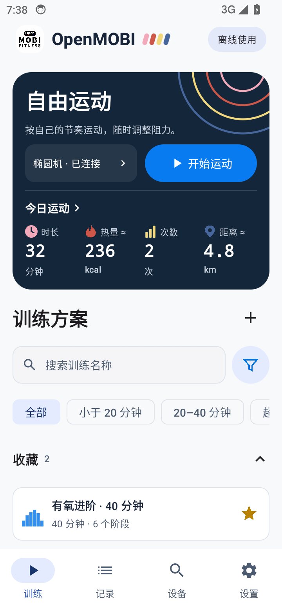
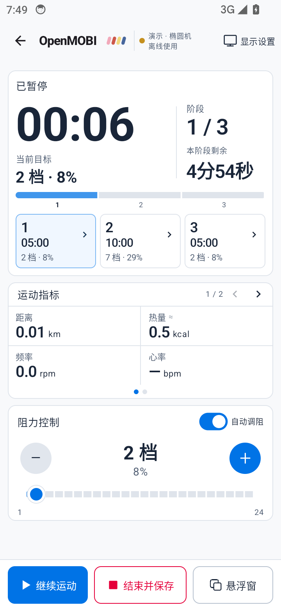

# 界面展示 / Screenshots

[首页 / Home](../README.md) · [English home](../README.en.md)

以下是运行中的应用截图，不是设计稿。来自 Android 14 模拟器；连接状态与运动记录为测试示例，不代表实机兼容性。These are actual running-app captures, not design mockups. They use an Android 14 emulator with test connection states and workout data; they do not prove hardware compatibility.

## 手机首页与设备 / Phone home and devices

 

## 平板深色模式 / Tablet dark mode

## 设置 / Settings

## 运动与记录 / Workout and history

 

运动页、小窗与大窗的指标均可自行选择，浅深色与语言可在设置中切换。You can choose the metrics for the workout page and each floating-panel size, and change theme/language in settings.
