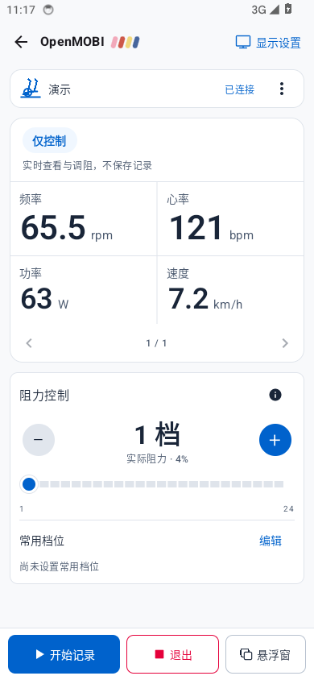
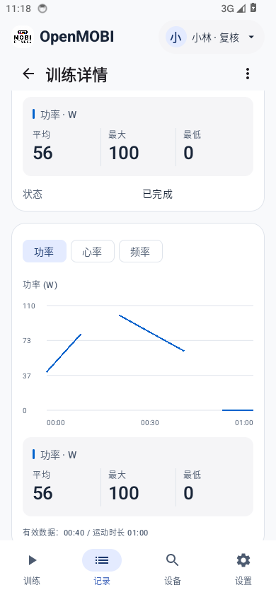
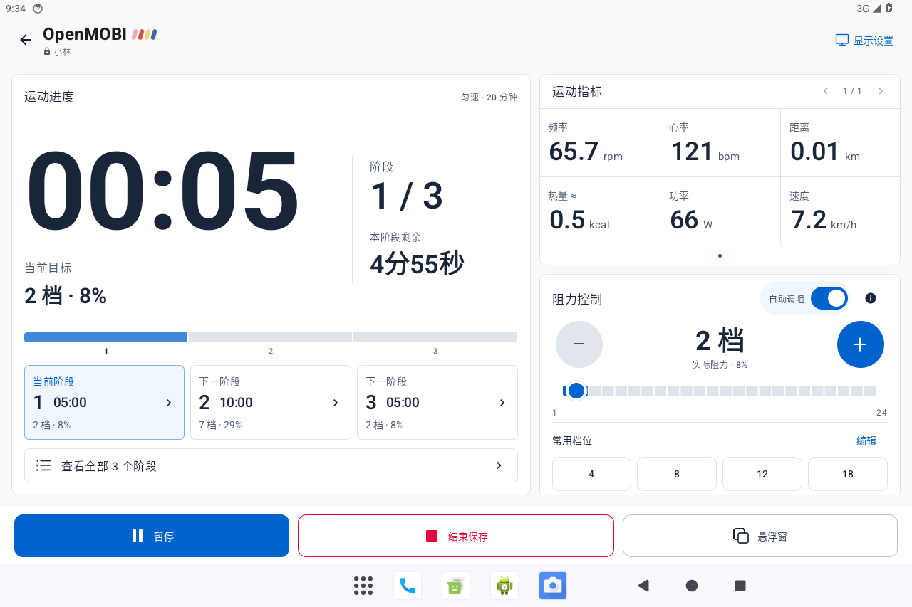
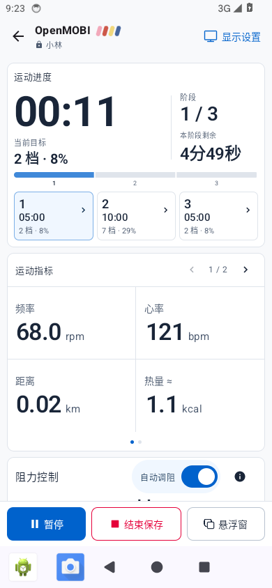
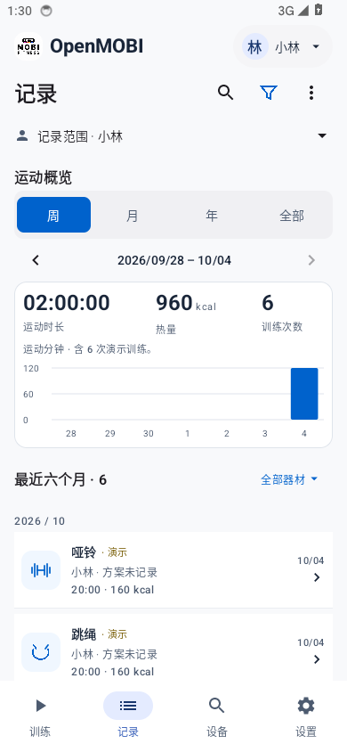
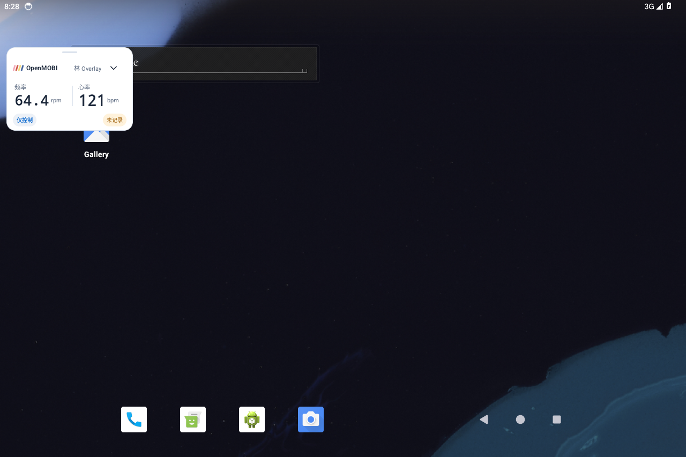
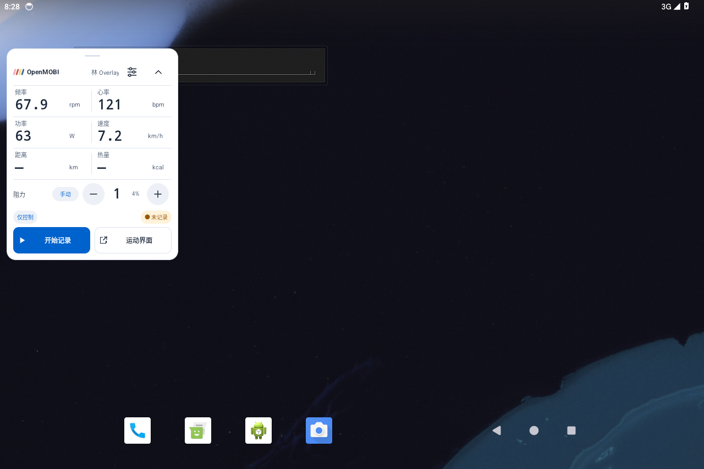
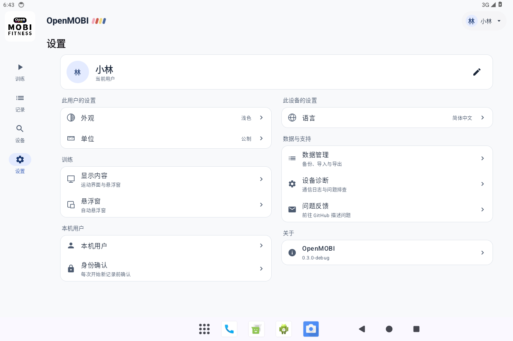

# 界面展示 / Screenshots

[首页 / Home](../README.md) · [English home](../README.en.md)

以下是 **v0.3.1 与未受本次修改影响的 v0.3.0 实际运行截图**，来自 Android 14 模拟器，使用 Debug 合成演示数据。新版改动见[发布说明](releases/v0.3.1.md)，原有页面的验证范围见[版本验证](V030_VALIDATION.md)与[界面精修](V030_REFINEMENTS.md)。模拟器展示不代表真实器材兼容性。

These are **actual v0.3.1 captures and unchanged v0.3.0 views** from an Android 14 emulator with synthetic Debug data. See the [release notes](releases/v0.3.1.md#english) for new behavior, and [validation](V030_VALIDATION.md#english) and [interface refinements](V030_REFINEMENTS.md#english) for the earlier scope. Emulator captures do not establish hardware compatibility.

## 直接退出与功率折线 / Direct exit and power lines · v0.3.1

仅控制模式在底部提供「退出」；报告默认优先展示有数据的功率折线，缺测区间断开，真实零值保留。

Control-only mode has an Exit action in the bottom dock. Reports prefer available power as a line, leaving missing intervals disconnected and preserving measured zeros.

| 底部退出 / Bottom Exit action | 功率折线 / Power line chart |
| :---: | :---: |
|  |  |

## 平板训练 / Tablet workout

六项指标同时展示，单位紧邻数值并保持稳定；翻页顺序为「〈 页码 〉」，常用档位保持单行。

Six readings appear together with stable units beside their values. The page number sits between navigation buttons; resistance presets stay on one row.

## 手机与记录 / Phone and history

| 运动指标 / Live readings | 周概览 / Weekly history |
| :---: | :---: |
|  |  |

## 悬浮窗 / Floating panels

标题保留品牌和当前用户；未记录状态单独提醒，大窗高度按显示内容调整。

The header retains the brand and current user. Unrecorded state is highlighted, and expanded height follows the selected content.

| 小窗 / Compact | 大窗 / Expanded |
| :---: | :---: |
|  |  |

## 设备与设置 / Devices and settings

宽屏按信息用途分成均衡两栏，窄屏按阅读顺序排列。

Wide layouts balance functional groups across two columns; narrow layouts retain a single reading order.

