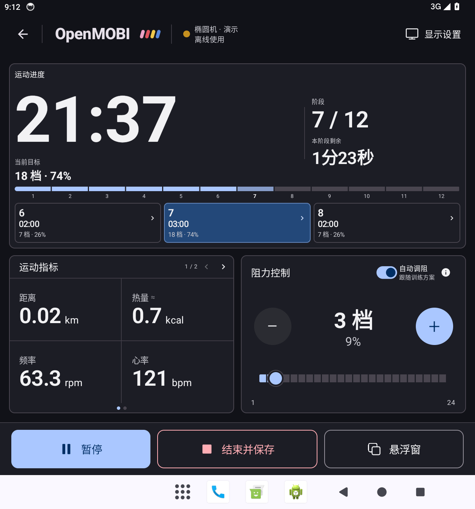
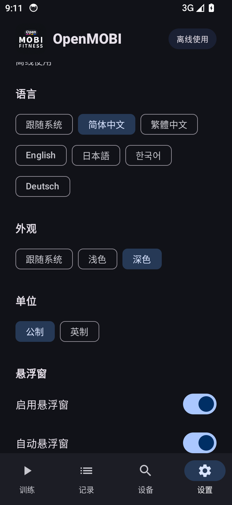

# alpha.4 运动页设计与验证

用户运动时需要首先看清已经运动多久、当前阶段还剩多久、接下来如何变化；调阻、暂停、结束是稳定的操作位置。指标不应挤占整个屏幕，也不应把保存藏在溢出菜单中。

## 布局与交互

以用户确认的生成稿为直接视觉基准：细灰边框、10 dp 圆角、深蓝灰文字、蓝色主操作、明确的红色保存描边。使用真实原生控件和原创小型矢量图标，不用整张设计图替代界面。

- 横向平板约 58:42 分栏：左侧大计时、阶段与分秒倒计时、当前目标、分段进度条、相邻三阶段及全部阶段入口；右侧上方 3×2 指标、下方阻力控制。两栏按可用高度分配，避免右下留白。
- 手机竖屏保持相同层级，指标改为 2×2 分页，提供页码、箭头、圆点和滑动。底部暂停、结束保存、悬浮窗始终固定。小窗口和大字体允许滚动，所有操作都可到达。
- 平板竖屏按可用高度组织一列三块面板。手机横屏采用紧凑双栏，档位、百分比、加减与滑块合并为一行；近方形折叠屏将进度放上方，指标与阻力在下方并列；其他折叠窗口按实际宽高重排，并为系统报告的分隔铰链留出空间。实体铰链行为仍需实测。
- 大计时和主界面指标使用粗细有层级的无衬线字体及等宽数字特性（`tnum`）；它与设计稿更接近。悬浮窗则保留用户要求的真正等宽字体。
- 加减按钮为圆形，滑块由分段轨道和带白边的圆形拇指组成。阻力百分比独立、较小、较淡；中央档位只认实际反馈，滑块可显示待确认请求。自动调阻开关与自动悬浮是两个不同功能。
- 自动悬浮放在「设置 → 悬浮窗」，与悬浮总开关一起提供，默认开启；训练页不另放低频设置。右上角仅保留「显示设置」，没有重复三点菜单。
- 四种装饰色一起出现在小型品牌标记。生成稿中的三条色带和示例 1–20 量程不照搬：实装保留四种颜色和器材真实范围。简体中文倒计时保留“X分X秒”。
- 悬浮面板固定两种尺寸；标签、数值、单位各占独立空间。增长的数字仅缩字号，不推动相邻内容。估算标记在标题后，阻力百分比较小且较淡。
- 保留 alpha.3 已获用户认可的图标资源，未重新生成或修改应用图标。

参考 [Concept2 ErgData](https://www.concept2.com/ergdata) 对可配置指标、清晰数字和明暗模式的处理，以及 [Android supporting pane 布局](https://developer.android.com/develop/ui/compose/layouts/adaptive/canonical-layouts) 的主内容与辅助内容组织方式。这里的界面是针对 OpenMOBI 的原创实现，不复制其他应用的画面或资产。

屏幕常亮只属于可见运动页，退出运动页即清除；后台遵循系统显示策略，符合 [Android 屏幕常亮 API](https://developer.android.com/develop/background-work/background-tasks/awake/screen-on) 的使用范围。

## 生成设计稿

先通过内置 `image_gen` 工具生成静态设计参考，再用 Compose / 原生 Android View 实现；没有将整张图片当作界面。生成时使用英文标签便于比较布局，实装使用全部六种本地化资源。生成稿中的示例量程／数字不作为器材协议依据。

设计稿：[training-alpha4-concept.png](design/training-alpha4-concept.png)。实际截图位于 `docs/images/`；它们是运行中的模拟器画面，包含明确标注的演示数据。

实际使用的生成提示词：

```text
Create a high fidelity Android workout app UI design board for an independent offline fitness device controller named exactly 'OpenMOBI'. This is a product interface mockup for implementation, NOT a marketing poster. Show two flat screens next to each other on a restrained light neutral background: a large landscape tablet screen occupying left 70%, and a portrait Android phone occupying right 30%. No device mockup frames, no shadows outside screens, no stock photos, no decorative illustrations, no gradients, no glass. Mature commercial UX, informed by Garmin/Concept2 workout instruments, Apple Fitness's typography hierarchy, and Material 3 accessible touch controls, but original. Crisp neutral slate text, off-white surfaces, fine gray dividers, modest 12px radius; standard blue controls, muted red outlined finish button. Only tiny pink/red/yellow/blue four-segment brand accent together, once per screen. Header: back arrow, OpenMOBI, small connected elliptical status; only one visible 'Display' action, no overflow menu. Main priority is an enlarged workout progress area: very large monospaced elapsed time '21:36', stage '4 / 12', remaining countdown '01:24', current target 'Level 12 · 48%'. A thin segmented interval timeline and three adjacent stage rows labeled 'Previous', 'Now', 'Next', with time and target resistance, visibly clickable to full stage list. On tablet this occupies the left main column. Right column has a compact, carefully spaced 3 by 2 metric matrix (Distance 5.82 km, Energy 246 kcal, Cadence 64 rpm, Heart rate 128 bpm, Power 112 W, Speed 8.4 km/h) with no oversized card whitespace; beneath it a resistance control area with level 12 and smaller 48%, minus/plus, discrete horizontal slider, small automatic-control state. Fill landscape's lower right meaningfully with those real controls, no blank zone. Phone: progress area at top with large elapsed and countdown and three very compact adjacent stage rows; compact 2 by 3 metrics below or two by two with a clear '1 / 2' pager if space needs; compact resistance slider below. BOTH sizes have an always-visible bottom dock with 3 clearly labeled accessible actions: 'Pause', 'Finish & save', and 'Float', 48dp touch targets. Finish must be easy to find in portrait and landscape, distinct from pause, never hidden in a menu. No duplicate actions. Ensure all UI is completely visible within both screens. High-quality purposeful alignment and spacing, flat professional instrument dashboard, no generic rounded SaaS card wall. All visual numbers and labels precisely typeset in English for this reference board; implementation will localize.
```

运行时复核使用真实模拟器截图，检查首屏内容、滚动后的控件、第二页指标和底部保存栏。曾修正大计时挤掉目标、估算标记行高造成数值字号不一致、手机首屏滑块露不全等问题。具体已通过范围与仍需实机验证的部分见 [测试记录](TESTING.md)。

## 实际界面

下图均为 Android 模拟器真实画面，运动数据为已标注的演示数据。





